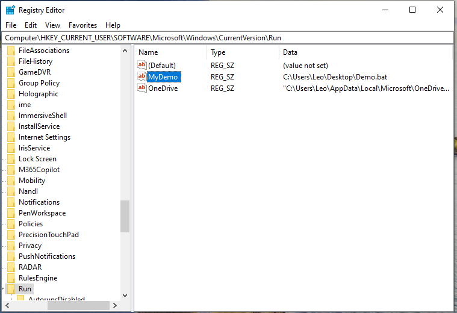
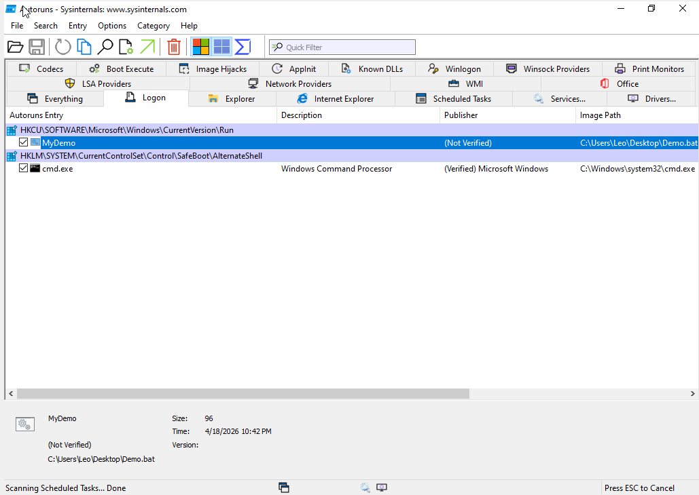
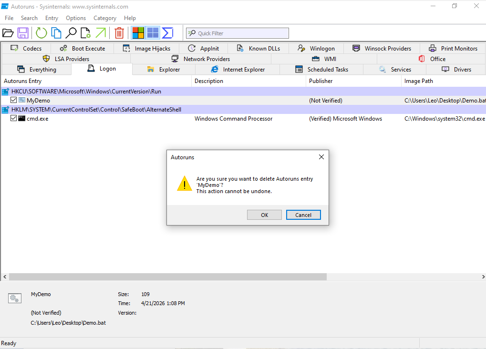

# Detecting and Removing Windows Persistence Using Autoruns

## Project Overview
This project demonstrates how a simple persistence mechanism works in Windows and how it can be detected and removed using Autoruns.

Persistence is a technique where a program is configured to run automatically every time the user logs in or the system starts. This is commonly used in real-world attacks to maintain access to a system.

The goal of this project is to simulate a basic persistence mechanism, detect it using Autoruns, and safely remove it.

---

## Project Relevance
Autoruns is an important tool in Incident Response because it allows analysts to identify programs and scripts that are configured to run automatically.

Persistence is commonly used by malware to maintain long-term access to a compromised system. Even if a process is terminated, it may reappear after a restart if persistence is not removed.

This project demonstrates how Autoruns can be used during the investigation, containment, and eradication phases of the Incident Response lifecycle.

---

## Tools Used
- Autoruns (Microsoft Sysinternals)
- Windows Registry Editor (regedit)
- VirtualBox (for safe testing environment)
- Simple script (`Demo.bat`)

---

## Methodology

### Setup and Environment
- Windows virtual machine running in VirtualBox
- Autoruns tool installed
- Registry Editor used to create persistence
- BAT script used to simulate activity

---

### Workflow
1. Create persistence using a Registry Run key  
2. Configure a BAT file to simulate activity  
3. Restart the system to confirm automatic execution  
4. Use Autoruns to detect the persistence entry  
5. Remove the persistence mechanism  
6. Verify that it no longer executes after reboot  

---

## Persistence Location
HKEY_CURRENT_USER\Software\Microsoft\Windows\CurrentVersion\Run

A string value (`MyDemo`) was created to execute the BAT file automatically at logon.

---

## Results

### Evidence
- The registry Run key successfully triggered the script at logon  
- Autoruns displayed the entry in the Logon tab  
- After restart, the script executed and created a text file  
- After removing the entry in Autoruns, the script no longer executed  

---

### Screenshots
Below are key stages of the process:

1. Registry Run key creation  
   

2. Autoruns detection (Logon tab)  
   

3. Persistence execution (text file created)  
   

4. Removing persistence using Autoruns  
   

---

## Project Steps

### 1. Create Persistence
A registry Run key was created in:

HKEY_CURRENT_USER\Software\Microsoft\Windows\CurrentVersion\Run

This key launches the script automatically when the user logs in.

---

### 2. Configure Script
A simple script (`Demo.bat`) was used to simulate persistence behavior.

---

### 3. Verify Execution
After restarting or logging in again, the script runs automatically, confirming persistence.

---

### 4. Detect Using Autoruns
- Open Autoruns  
- Navigate to the **Logon** tab  
- Locate the entry (`MyDemo`)  
- Analyze the file path and details  

---

### 5. Remove Persistence
- Disable or delete the entry in Autoruns  
- Reboot the system  
- Confirm that the script no longer executes  

---

## Key Takeaways
- Terminating a process is not enough — persistence can bring it back  
- Autoruns helps identify hidden autorun entries  
- Understanding startup locations is essential in Incident Response  

---

## Conclusion
This project demonstrates how persistence works in a controlled environment and how it can be detected and removed using Autoruns.

Autoruns is a powerful tool for analyzing startup mechanisms, but it requires user knowledge and should be used alongside other tools.

A potential improvement would be testing additional persistence techniques such as scheduled tasks or services.

---

## Notes
This project is for educational purposes only and demonstrates a controlled example of persistence in a safe environment.
